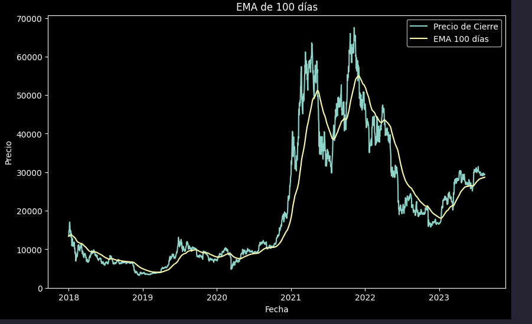
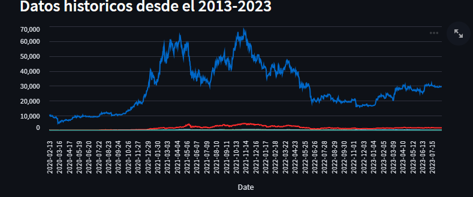

 
## Analisis Exploratorio De Datos De Criptomonedas
Este repositorio contiene herramientas y análisis relacionados con el mercado de criptomonedas. Visualizaciones, aquí encontrarás recursos útiles para analizar y comprender mejor las tendencias en el mundo de las criptomonedas.

## Contenido

- [Objetivo](#objetivo)
- [Metodologia](#propuesta)
- [Descripción](#descripción)
- [Características](#características)
- [Capturas de Pantalla](#capturas-de-pantalla)

## Objetivo
El objetivo de este proyecto es poder entender, examinar  las tendencias y comportamientos de las diferentes criptomonedas y encontrar un patron que se puede llegar a producir y obtener informacion sobre sus fluctuaciones para poder ingresar en el mercado de ellas
## <h2 id="propuesta">Propuesta de Trabajo</h1>

<ul>
<li><b>Recopilación de datos</b> : Recopile datos de dos fuentes donde una fue coingecko que lo hice a través de los endpoints donde tuve que inputar valores faltantes por fecha con 0 y la otra api que use fue la de binance para obtener los datos por medio de un framework que se hace mucho más fácil su acceso a la información</li>
<li><b>Analisis</b> : Hice un analisis de los datos, buscando en internet, eventos, noticias, desarrollos que podrian haber afectado el precio de las criptomonedas</li>
<li><b>Otros Factores a tener en cuenta </b> : Las criptomonedas son un mercado super volatil, ya que estas pueden variar dependiendo el contexto global, temas de los que se estan hablando, desarrollo en la tecnologia, una fuerte tendencia en el mercado de las criptos o cualquier otro factor externo</li>

</ul>

## Descripción

En un mercado financiero tan volatil como el de las criptomonedas, contar con herramientas y análisis precisos es esencial. Este repositorio pretende ofrecer una variedad de recursos que permitan a los usuarios analizar, visualizar y comprender mejor los datos relacionados con las criptomonedas. En este proyecto hice un analisis a las siguientes criptomonedas  bitcoin, ethereum,  litecoin, binancecoin,cardano, ripple,stellar,solana, dogecoin. Algunas de ellas las elegi por la popularidad que tienen en el mercado, otras por los proyectos que estan atras y otras por la popularidad de ser solo un meme y que lo haya adoptado fácil el mercado como es el caso de dogecoin 

## Características

- Visualizaciones interactivas de datos históricos de criptomonedas.
- Herramientas para analizar la volatilidad y tendencias del mercado.
- Recursos para obtener y procesar datos de fuentes confiables.

## Capturas de Pantalla

## Resultados

<li>Identifique Patrones que suelen repetirse a lo largo del tiempo o tambien como las "masas" hacen que el valor aumente tanto como paso en 2021 con el bitcoin. Ya que la gente estaba super interesada en este mundo de las criptos todos entraron y todos empezaron a invertir, pero podemos hacer un analisis tecnicos con las diferentes metricas, kpis seleccionados donde podemos mas o menos predecir si el mercado esta en bajista o alcista </li>

## Muchas Gracias
